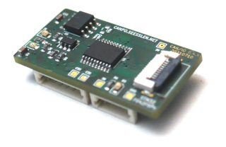

# Libbringup

    

## Overview

**WARNING**
This repository exists primarily to keep projects compilable. You are probably 
not interested in it.

Libbringup is a small library for initially testing small handmade PCBs. It can 
be used to check for soldering issues or errors in the schematics.

The target platforms are PCBs with STM32-Controllers which are using libbiwak. 
The MCUs flash sizes may be very small down to 16KBytes.

An application can use this library for example to test LEDs, Buzzer, I2C-EEPROM 
and will create an markdown-protocoll.
